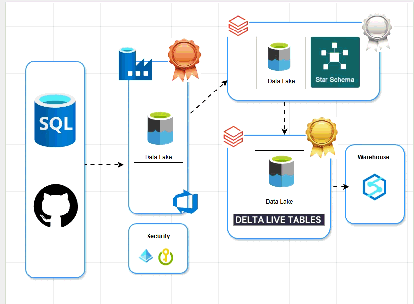
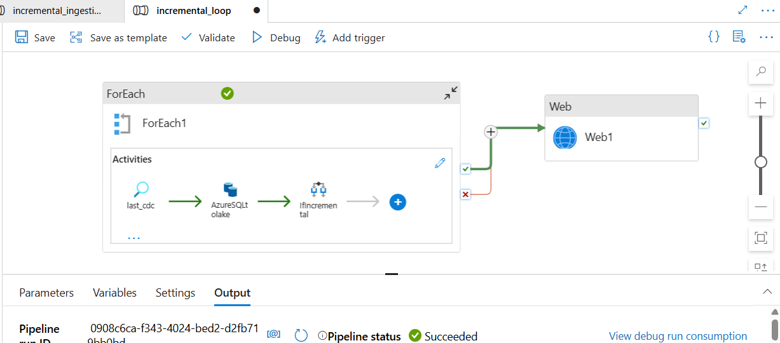
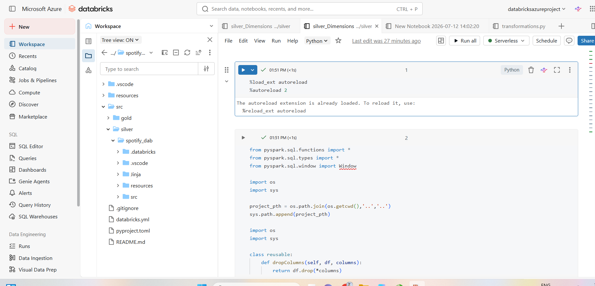

# 🎵 Spotify Real-Time Data Engineering Pipeline (Azure | Databricks)

> **Production-grade Azure Data Engineering Pipeline implementing Incremental Loading, CDC, Medallion Architecture, Delta Lake, Unity Catalog, and Delta Live Tables (DLT).**

---

# 📌 Project Overview

This repository demonstrates an enterprise-grade **end-to-end Azure Data Engineering pipeline** that ingests Spotify streaming data from **Azure SQL Database**, performs **incremental loading using Azure Data Factory**, transforms data using **Azure Databricks (PySpark)**, and produces analytics-ready datasets using **Delta Live Tables (DLT)**.

The project follows the **Medallion Architecture (Bronze → Silver → Gold)** and implements **Change Data Capture (CDC)**, **Spark Structured Streaming**, **Delta Lake**, **Unity Catalog**, and **Databricks Asset Bundles (DABs)** following real-world production practices.

---

# 🎬 End-to-End Pipeline

<p align="center">
  
</p>

---

# 🛠️ Tech Stack

| Category | Technology |
|------------|------------|
| Cloud | Microsoft Azure |
| Storage | Azure Data Lake Storage Gen2 |
| Database | Azure SQL Database |
| ETL | Azure Data Factory |
| Processing | Azure Databricks |
| Compute | Apache Spark |
| Language | Python, PySpark |
| Streaming | Spark Structured Streaming |
| Storage Format | Delta Lake |
| Catalog | Unity Catalog |
| Gold Layer | Delta Live Tables |
| Deployment | Databricks Asset Bundles |
| Source Control | GitHub |

---

# 🏛️ Architecture Flow

```
Azure SQL Database
        │
        ▼
Azure Data Factory
(Incremental Loading + CDC)
        │
        ▼
Bronze Layer (ADLS Gen2)
Raw Parquet Files
        │
        ▼
Silver Layer (Databricks)
Cleaning
Deduplication
Streaming
Transformations
        │
        ▼
Gold Layer (DLT)
CDC
SCD Type 1
Star Schema
        │
        ▼
Azure Synapse / Power BI
Analytics & Reporting
```

---

# 📥 Phase 1 – Incremental Data Ingestion (Azure Data Factory)

The ingestion layer uses **Azure Data Factory** to extract data incrementally from Azure SQL Database.

Instead of copying the entire dataset every execution, a **watermark table** tracks the last processed timestamp. Only new or updated records are ingested into the Bronze layer.

### Features

- Metadata-driven pipeline
- Lookup Activity
- ForEach Activity
- Incremental Copy
- Watermark Table
- CDC Logic
- Dynamic SQL Query
- Parameterized Pipelines

---

## Azure Data Factory Pipeline

<p align="center">
  
</p>

---

# 🥉 Bronze Layer

The Bronze layer stores raw source data exactly as received from Azure SQL Database.

### Features

- Raw data ingestion
- Parquet files
- Historical storage
- Schema preservation
- Immutable storage
- Landing zone

---

# 🥈 Phase 2 – Silver Layer (Azure Databricks)

The Silver layer performs data cleansing and business transformations using **Spark Structured Streaming**.

Each incoming dataset is processed using **Auto Loader**, cleaned, validated, deduplicated, and stored as Delta tables.

The project writes Delta files directly into ADLS Gen2 before registering them in Unity Catalog.

---

## Databricks Notebook

<p align="center">
  
</p>

---

## Silver Layer Transformations

Implemented transformations include:

- Auto Loader
- Schema Evolution
- Structured Streaming
- Remove Duplicate Records
- Drop Rescued Columns
- Uppercase User Names
- Duration Category Creation
- Remove Special Characters
- Data Validation
- Delta Table Creation

Example transformations:

- Convert usernames to uppercase
- Categorize tracks into Low / Medium / High duration
- Remove unwanted characters
- Remove duplicate records
- Handle schema evolution automatically

---

# 🥇 Phase 3 – Gold Layer (Delta Live Tables)

The Gold layer is implemented using **Databricks Delta Live Tables (DLT)**.

Instead of traditional notebook pipelines, declarative DLT pipelines manage data lineage, dependencies, CDC logic, and data quality automatically.

---

## Gold Layer Features

- Delta Live Tables
- Streaming Tables
- APPLY CHANGES
- Change Data Capture
- SCD Type 1
- Data Lineage
- Automatic Dependency Management

---

## Gold Layer Flow

```
Silver Tables
      │
      ▼
Streaming Staging Tables
      │
      ▼
Delta Live Tables
(APPLY CHANGES)
      │
      ▼
Gold Tables
      │
      ▼
Power BI / Synapse Analytics
```

---

# 🔄 Change Data Capture (CDC)

CDC is implemented throughout the pipeline to ensure only new and modified records are processed.

### CDC Features

- Watermark Table
- Incremental SQL Queries
- Delta MERGE
- APPLY CHANGES
- Streaming Updates

Benefits:

- Faster Processing
- Lower Compute Cost
- No Duplicate Processing
- Production Ready

---

# 🔐 Security

The project follows Azure security best practices.

Implemented security includes:

- Azure Managed Identity
- RBAC (Role-Based Access Control)
- Unity Catalog Permissions
- External Locations
- Secret-less Authentication
- ADLS Gen2 Secure Access

---

# ⚡ Performance Optimizations

Several optimizations are implemented to improve performance.

- Incremental Loading
- Spark Structured Streaming
- Auto Loader
- Trigger Once
- Delta Lake
- Checkpointing
- Schema Evolution
- Idempotent Pipelines
- Delta MERGE
- Optimized Delta Reads

---

# 📊 Business Use Cases

The pipeline enables several real-world analytical scenarios.

- User Listening Behaviour
- Artist Popularity Analysis
- Track Popularity
- Streaming Analytics
- Near Real-Time Dashboards
- Business Intelligence Reporting
- Customer Engagement Analytics

---

# 📂 Repository Structure

```
Spotify-Azure-Data-Engineering-Project
│
├── ADF
│   ├── Pipelines
│   ├── Linked Services
│   └── Datasets
│
├── Databricks
│   ├── Bronze
│   ├── Silver
│   ├── Gold
│   └── Utils
│
├── Architecture
│
├── Images
│   ├── Architecture.png
│   ├── Architecture.gif
│   ├── adf_pipeline.png
│   ├── silver_notebook.png
│
└── README.md
```

---

# ⭐ Skills Demonstrated

- Azure Data Factory
- Azure SQL Database
- Azure Data Lake Storage Gen2
- Azure Databricks
- Apache Spark
- PySpark
- Spark Structured Streaming
- Delta Lake
- Unity Catalog
- Delta Live Tables
- Databricks Asset Bundles
- Change Data Capture (CDC)
- Incremental Loading
- Medallion Architecture
- ETL / ELT
- Data Engineering
- Lakehouse Architecture
- Cloud Data Engineering

---

# 🚀 Key Highlights

✅ End-to-End Azure Data Engineering Project

✅ Metadata-Driven Azure Data Factory Pipelines

✅ Incremental Loading using Watermark Logic

✅ Change Data Capture (CDC)

✅ Medallion Architecture (Bronze → Silver → Gold)

✅ Spark Structured Streaming

✅ Delta Lake

✅ Unity Catalog

✅ Delta Live Tables (DLT)

✅ Production-Ready Design

---

# 👨‍💻 Author

**AtMunesh**

Azure Data Engineer | Databricks | PySpark | Azure Data Factory | Microsoft Fabric | SQL | Power BI

If you found this project useful, consider giving it a ⭐ on GitHub!
